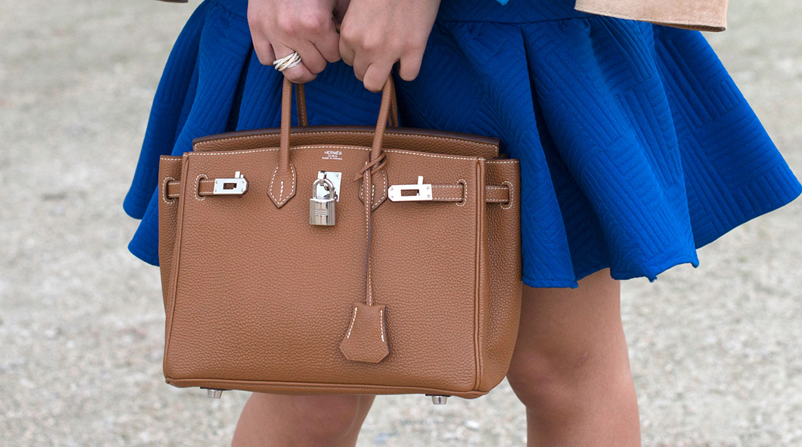
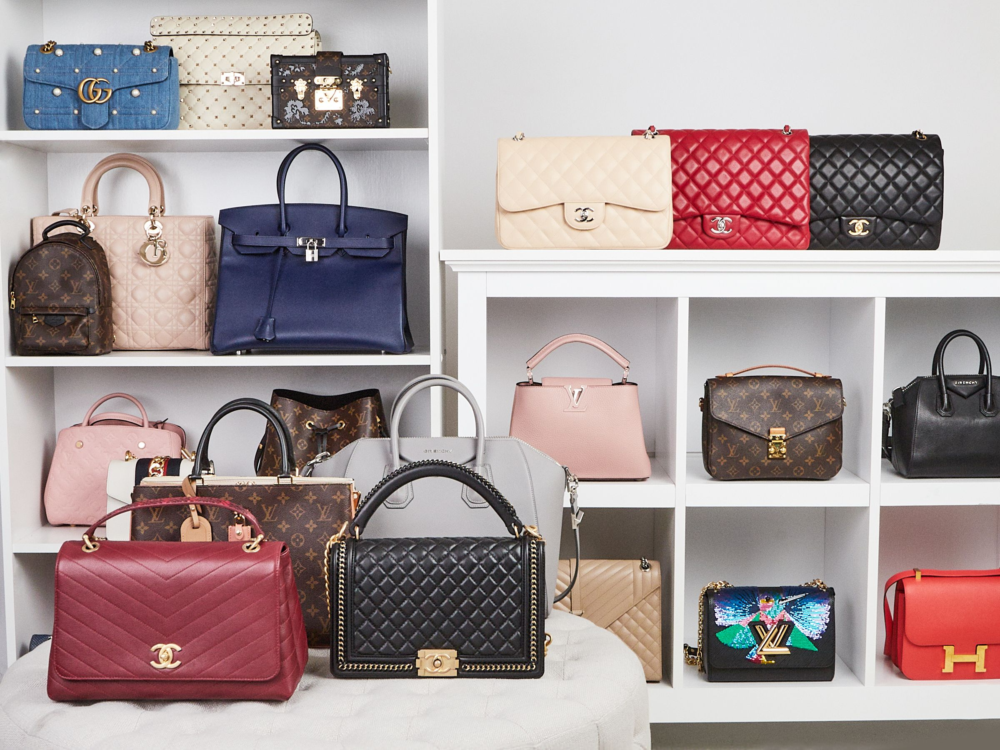

 <!-- markdownlint-disable MD033 -->
 <figure class="figure">
    
    <figcaption class="figure__caption">Title</figcaption>
</figure>

 ## London
  A woman walks into one of the large flagship stores on London’s Bond Street, where she is greeted by a vast display of handbags. Pouches, totes, cross-body, baseball style, shoulder bags and shoppers — the whole handbag family is there, with price tags upwards of £1,000 ($1,317). She is businesslike in her approach, wasting no time on handling them or deliberating over her choice. “That one.” “That one.” “That one.” “That one.” “And that one over there.” She points at five. “I’ll take the rest.” The story was told with both amusement and delight by the store manager.

Ah, the glory of the bag — it’s the item that every brand hopes will sustain them through good times and bad. The product that has been relied upon for sales when ready-to-wear is having a weak season, or in better times, is simply the lovely, high-profile icing on the cake, adorning store windows and providing catwalk fodder, while contributing only a small percentage to the bottom line.

<figure class="figure">
    
    <figcaption class="figure__caption">Title</figcaption>
</figure> 

## Is there ever enough handbags?
 
 You might have thought that there were enough handbags in the world to see us through to Armageddon. Yet, every season the showrooms of the world’s biggest fashion houses are crammed with new ranges to tempt the customer. Devoted PRs are given the task of enthusing about the newest and most telling details — the reworked links on the handles, the innovative clasp, the soft-sided capacious lightness, the elegant simplicity of the handheld style. And of course, with each season comes the introduction of the new ‘Icon’ bag — a phrase that every time I hear it makes me wince, for its overused appropriation, and which should only be employed in the case of something truly powerful. Not a calf leather tote, no matter how gorgeous.

Still, handbags do so much more than simply the role they fulfill. In the canon of fashion items, the handbag is a relative newcomer having arrived as the new kid in town in the early 20th century. Hermès’ fascinating monograph in “Carried Away”, a lavish illustrated volume, published to accompany a former “Le Cas du Sac” exhibition, features an ancient rock painting in Algeria, where one of the terracotta stick figures appears to have a bag in the crook of their elbow. But as civilisations evolved, bags were rarely attached to the body and were relegated to the company of animals and servants.