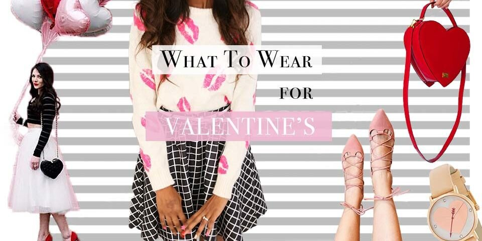
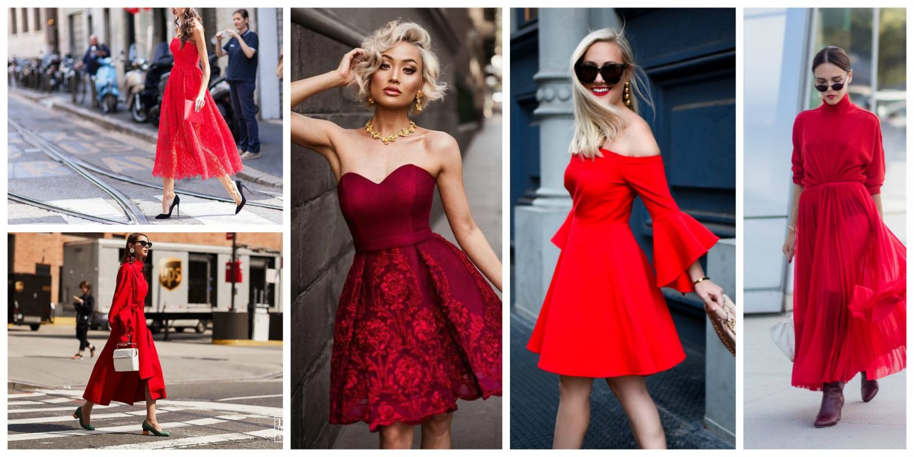

 <!-- markdownlint-disable MD033 -->
  <figure class="figure">
    
    <figcaption class="figure__caption">Valentines day</figcaption>
</figure> 

 Flirty elements like an open back, corset-cinch front, puff sleeves, and yes, the little heart pattern — a Valentine's Day knockout, no matter how or with whom you're enjoying the night. So floaty and ethereal — and it works as either a mini dress or a top over skinny jeans or leggings.   With Valentine's Day right around the corner, it's time to start prepping the ultimate date night outfit. While classic reds and pinks might be an obvious choice, winter whites and blazer dresses give a different twist on V-day style. No matter what kind of date night you have planned for February 14 or beyond, take a look at these stylish outfit ideas straight from the celebs. Plus, shop the ultimate gift ideas here.
 <figure class="figure">
    
    <figcaption class="figure__caption">Red dresses</figcaption>
</figure> 

##Short or long red dress??
 
With Valentine's Day right around the corner, it's time to start prepping the ultimate date night outfit. While classic reds and pinks might be an obvious choice, winter whites and blazer dresses give a different twist on V-day style. No matter what kind of date night you have planned for February 14 or beyond, take a look at these stylish outfit ideas straight from the celebs. Plus, shop the ultimate gift ideas here.