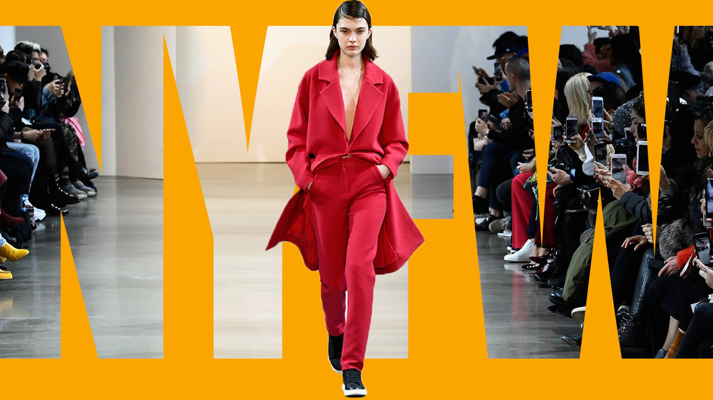
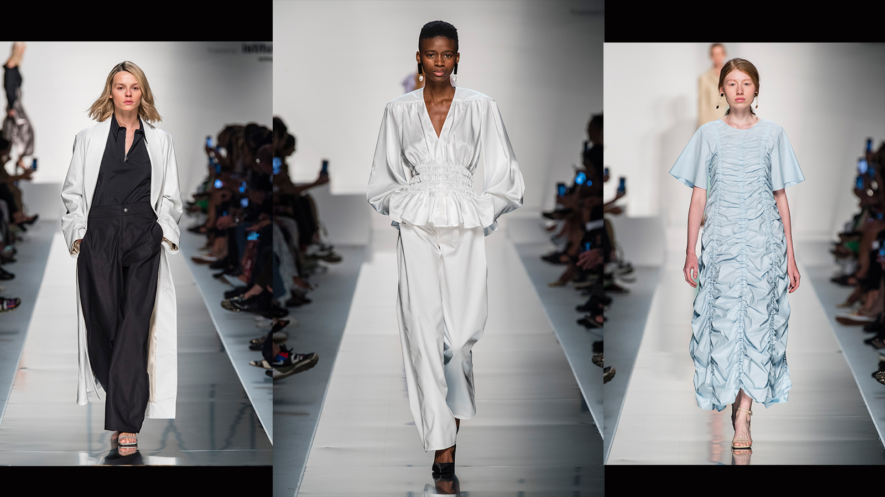
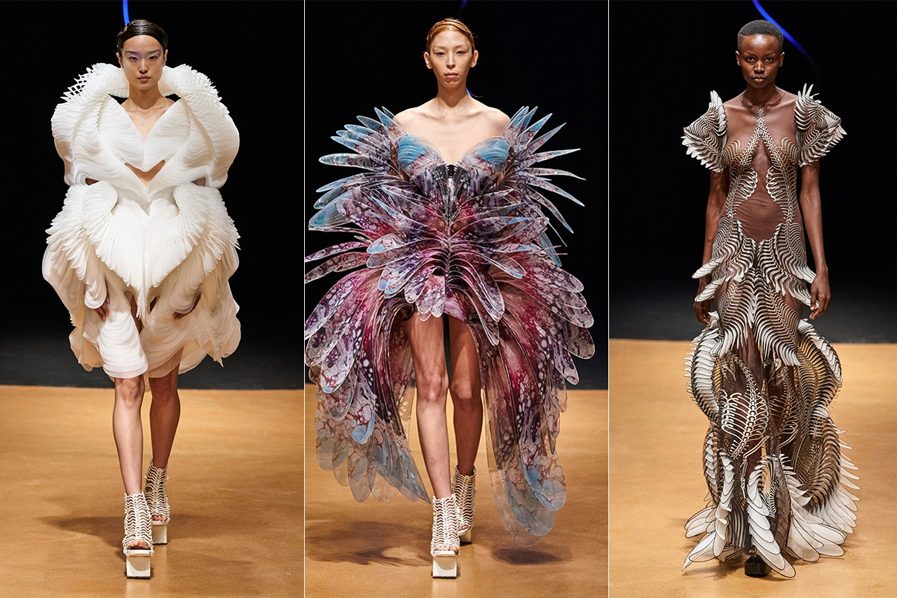

 <!-- markdownlint-disable MD033 -->
 <figure class="figure">
    
    <figcaption class="figure__caption">Fashion week</figcaption>
</figure>

## Always the best!
<b>Nynne Kunde</b>, the talented winner of <b>I’M ALUMNI COLLECTIONS ® EVOLUTION</b>, made her debut on the catwalks of Milan fashion week showcasing her collection ‘Ducens Domina’.

After receiving her degree in Fashion Design from Istituto Marangoni London in 2018, Nynne was named ‘Womenswear Designer of the Year’ and, with the launch of her own label NYNNE, a contemporary luxury brand focused on craftsmanship and exaggerated silhouettes, is beginning her journey of professional growth.  

The fashion show, held at Palazzo Serbelloni, gave the young Danish designer the chance to present to the public her refined technical skills and stylistic signature, expressed through the idea of a woman who has a strong personality, is pragmatic and the star of the show. “Ducens Domina” is in fact a collection that is striking for the originality of the silhouettes and the pairing of the fabrics, characterized by a glamorous 1940s style accentuated by voluminous shapes crafted in silk, wool, cotton and leather, and by a palette of pastel colours that go from lavender to yellow all the way to warm cognac.  

<figure class="figure">
    
    <figcaption class="figure__caption">Designer: Nynne Kunde</figcaption>
</figure>

<figure class="figure">
    
    <figcaption class="figure__caption">Designer: Donna Karan</figcaption>
</figure>

<figure class="figure">
    
    <figcaption class="figure__caption">What to dress on fashion week?</figcaption>
</figure>

 

 
 
 An important debut that saw the young designer hosted on the catwalk of Ermanno Scervino, one of Istituto Marangoni Brand Ambassadors who has always supported new generations of designers both as a mentor and a promoter of visibility for promising fashion talents.   

“For me, it is a real pleasure to be able to give concrete assistance to young creative people. Organizing a fashion show is a fundamental component of the promotion and visibility of collections: hosting Nynne at Palazzo Serbelloni, I am proud to contribute to supporting her and most of all to share my knowledge and experience with her. I will watch her fashion show with great interest, because engaging with the aesthetics of new talents is always stimulating,” said Ermanno Scervino.