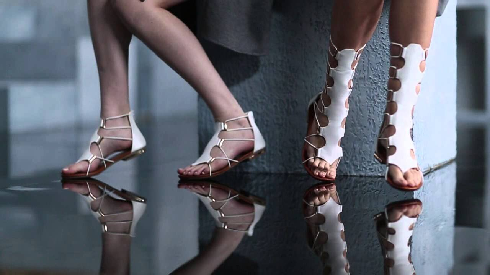

 <!-- markdownlint-disable MD033 -->

<figure class="figure">
    
    <figcaption class="figure__caption">Parisian shoes</figcaption>
</figure>

There’s nothing like a new pair of shoes to get me excited for the new season, and lucky for me, editor-approved Parisian bag brand Elleme is branching out into shoes. Launching next week, the designs embody what makes the handbags cult items: minimalism, addictive colours and a bit of a design twist.
Here’s everything you need to know about the shoes, from designer Jingjing Fan.

 ## Are the shoes a natural extension of your bag line?
Yes, absolutely. Key details include the organic shape, the hand-stitched finishing, and some folded play with the leather. Launching our shoe line came very naturally, constantly working with leather artisans in Italy, we wanted our shoe line to be seamless from our bag collection. You can find our signature hand-stitched and folded designs, all with a buttery lambskin or cowhide leather.
I simply wanted to create something that I would like wear. Paris is where I am based and where I get inspired a lot, just a quick stroll at the park or on streets around our neighbourhood Le Marais would get all ideas flowing. The most important thing for me is the comfort, there’s a saying that with a good pair of shoes, a women can conquer the world. My design philosophy stays the same: Simplicity, Timelessness and Singularity. We want the user to be comfortable, to be able to wear this pair of shoe over the years and also stand out discreetly.

