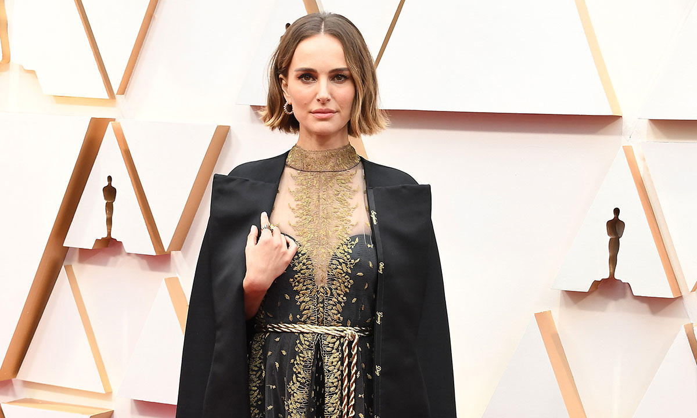
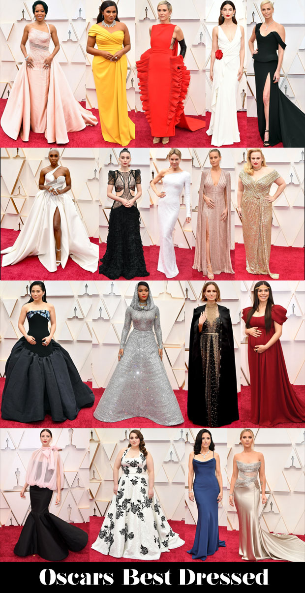

 <!-- markdownlint-disable MD033 -->
 <figure class="figure">
    
    <figcaption class="figure__caption">Natalie Portman</figcaption>
</figure>

 ## Few of the best dressed celebrities
 As the thrilling conclusion to the year’s awards race, the Academy Awards come with high expectations. The anticipation surrounding the winners and is matched only by the frenzy of the red carpet where stars bring exquisite fashion to life as the whole world watches. On occasion, the extreme level of interest can lead to risk-averse style choices, but 2020’s attendees dared to delight.

The themes which ran through the bulk of the season were carried forward with grace. Penélope Cruz dipped into the Chanel archives to revive a look from the spring/summer 1995 haute couture collection and give the night its flight of fancy. Natalie Portman made a feminist statement in Maria Grazia Chiuri’s ethereal embroidered cape with the names of female directors overlooked by the Academy stitched into the fabric. The push for sustainability was addressed via chic pieces like Kaitlyn Dever’s crimson Louis Vuitton look and the grand tradition of risqué red carpet fashion was honored by Scarlett Johansson in transparent corseted Oscar de la Renta. All in all, the decade’s first Oscar ceremony delivered exactly what it promised: a celebration of Hollywood glamour in all its forms.
 <figure class="figure">
    
    <figcaption class="figure__caption">Title</figcaption>
</figure> 
